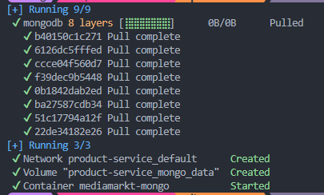

# MediaMarkt Product Service - Case study 🚀

This project is a reactive RESTful API developed for the MediaMarkt case study. It manages **Products** and **Categories** by implementing **"Ligthy"** **Hexagonal Architecture (Ports & Adapters)** and **Reactive Programming** to ensure maximum scalability, performance, and maintainability.

## 🛠️ Technology Stack

* **Java 17**
* **Spring Boot 3.x** (WebFlux for reactive and asynchronous programming)
* **Project Reactor** (Mono / Flux)
* **MongoDB** (Spring Data Reactive MongoDB)
* **Apache POI** (For reading Excel datasets)
* **SpringDoc OpenAPI (Swagger)** (API documentation)
* ...

## 🏗️ Architecture and Design Decisions

The project has been designed following the principles of **Clean Architecture**:

1. **Separation of Responsibilities (SRP):**

* **`domain`**: Pure models and business exceptions. Zero dependencies on external frameworks.
* **`application`**: Use Cases (`ManageProductsUseCase`) and Ports (Interfaces). These act as the central orchestrator of business rules.
* **`infrastructure`**: Secondary Adapters. This is where the MongoDB implementations, file reading (DataLoader), and AOP reside.
* **`interfaces`**: Primary Adapters. REST controllers that handle HTTP traffic and DTOs to prevent domain leaks (exposure of raw models).

2. **Reactive Programming (WebFlux):**
   Intensive use of non-blocking flows. A prime example is the dynamic resolution of category trees using the recursive `expandDeep()` operator to efficiently navigate from the leaves (products) to the root (absolute parents).
3. **Aspect-Oriented Programming (AOP):**
   A `LoggingAspect` class has been implemented in the infrastructure layer to standardize traceability and measure the actual execution times of `Mono` and `Flux` without cluttering the application layer.

## 🚀 How to Run the Project (Plug & Play)

To facilitate technical testing, the original Excel datasets have been included in the code along with a `DataLoader`. When the application starts, it will detect if the database is empty and automatically insert all the data so you can test the endpoints immediately.

*To be continued --> I have to improve this area adding docker.*

**For now, initial configuration you can use the following:**

```yaml
spring:
  data:
    mongodb:
      uri: mongodb://localhost:27017/masterdata
```

## **Local Execution:**

1. Clone the repo
2. Ensure you have Docker Desktop
3. Start the database

   ```bash
     docker compose up -d
   ```
4. You have to see something like this:

   

   
5. Finally execute:

```bash
   ./mvnw spring-boot:run
```

**Access the Swagger Documentation:**

Once the application displays in the console that the `DataLoader` has finished importing the Excel files, navigate to:

👉 **http://localhost:8080/swagger-ui.html**

## 🧪 Key Endpoints

From Swagger, you can test all the standard CRUD endpoints for **Categories** and **Products**.

## 🔧 Testing & Code Coverage

Unit tests have been implemented following best practices for  **reactive applications (Spring WebFlux)** , focusing on validating both business logic and REST layer behavior.

**For testing I used:**

* **JUnit 5**
* **Mockito**
* **WebTestClient** (for reactive controller testing)
* **StepVerifier** (for validating reactive streams)

### 🔹 Current Test Coverage Scope

The project features comprehensive test coverage across all critical layers, achieving a **100% coverage rate** in both controllers and database adapters:

* **Application Layer (Use Cases):** `ManageCategoryImplTest`, `ManageProductsImplTest`
* **Interfaces Layer (Controllers):** `ProductControllerTest`, `CategoryControllerTest`
* **Infrastructure Layer (Adapters):** `ProductRepositoryAdapterTest`, `CategoryRepositoryAdapterTest`
* **Global Error Handling:** `GlobalExceptionHandlerTest`

### 🤖 CI/CD & Automated Testing

To guarantee code quality and eliminate repetitive manual tasks, the entire testing and analysis workflow has been fully automated using **GitHub Actions**.

Whenever code is pushed to the `main` branch or a Pull Request is opened, the CI pipeline triggers automatically:

1. **Automated Test Execution**: The pipeline runs `mvn clean verify`, executing the full suite of unit tests. This acts as an immediate safety net, ensuring no breaking changes or regressions are merged.
2. **JaCoCo Coverage Generation**: During the test execution phase, the JaCoCo Maven plugin automatically generates a detailed XML test coverage report.
3. **SonarCloud Integration**: Finally, the pipeline sends the JaCoCo coverage report and the source code to SonarCloud.

### 📊 SonarQube Cloud [](https://sonarcloud.io/summary/new_code?id=Siralexisstar_example.mediamarkt.product-service)

SonarCloud acts as our automated **Quality Gate**. It performs deep static code analysis to detect bugs, code smells, and security vulnerabilities. By automating this workflow, developers receive immediate, objective feedback directly on their Pull Requests regarding code quality and test coverage, entirely eliminating the need for manual review of these metrics.
